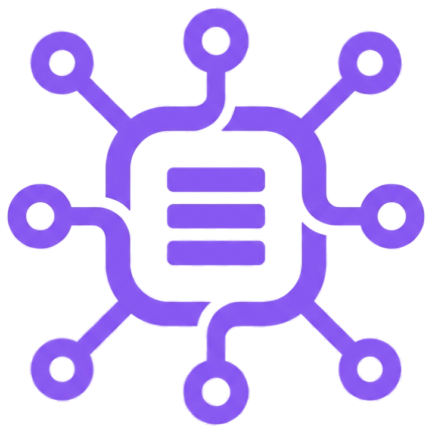

<div align="center">
  
  <h1>NexQuery AI</h1>
  <p><strong>智能数据协作平台 (Intelligent Data Collaboration Platform)</strong></p>
  <p>面向运营与非技术人员，通过 AI 驱动的自然语言交互，实现安全、自主的数据消费与分析。</p>
</div>

<div align="center">


</div>

## 📖 简介 (Introduction)

**NexQuery AI** 是一个现代化的 Text-to-SQL 数据协作平台。它致力于解决“业务提数难、研发排期长”的痛点，通过 Agentic workflow 让运营人员能够用自然语言直接查询数据库，同时保障企业级的数据安全与权限管控。

### 核心价值
1.  **自助提数 (Self-Service)**: 运营人员无需懂 SQL，直接提问即可获取数据报表。
2.  **安全可控 (Enterprise Safe)**: 细粒度的 RBAC 权限、PII 敏感数据自动脱敏、SQL 注入防御与审计日志。
3.  **闭环进化 (Self-Evolving)**: 支持用户反馈 (Feedback) 与知识库 (Knowledge Base) 联动，AI 越用越聪明。
4.  **成本透明 (FinOps)**: 内置 AI 成本监控，实时追踪 Token 消耗与模型费用。

---

## 🚀 核心功能 (Features)

### 🤖 AI 智能引擎 (Agentic Engine)
*   **Dual-Mode Chat**:
    *   **SQL Agent**: 深度结合数据库 Schema，支持 Text-to-SQL、错误自修复、歧义主动询问 (Disambiguation) 与思维链展示。
    *   **General Chat**: 像 ChatGPT 一样的通用问答模式，处理非数据库类问题。
*   **Smart Optimization**: AI 自动分析 SQL 性能，提供索引建议与重写方案。
*   **Mind Chain**: 透明展示 AI 的推理过程 (Reasoning)、工具调用 (ListTables, ValidateSql) 与自我纠错逻辑。
*   **Knowledge RAG**: 将用户认可的优质 SQL 沉淀为知识库，增强 AI 在特定业务场景下的准确率。

### 🔌 多源数据接入
*   **Supported Sources**: PostgreSQL, MySQL, HTTP API (cURL 适配)。
*   **Auto-Discovery**: 自动扫描数据库元数据，利用 AI 识别手机号、邮箱等 PII 敏感字段并配置脱敏规则。
*   **Schema Sync**: 定时或触发式同步最新的表结构至向量数据库。

### 🛡 安全与治理
*   **RBAC**: 基于角色的权限控制 (Admin, Developer, Operator)，支持动态菜单与按钮级权限。
*   **Security Guardrails**:
    *   拦截 `DROP`, `TRUNCATE` 等高危指令。
    *   强制 WHERE 子句检查（防止全表更新）。
    *   生产环境 SQL 报错屏蔽。
*   **2FA**: 集成 Google Authenticator 双重认证。
*   **FinOps**: 完整的 Token 消耗监控看板，支持按用户、模型维度的成本拆分。

### ⚙️ 自动化与触达
*   **Task Scheduler**: 支持 Crontab 定时执行 SQL 报表任务。
*   **Multi-Channel Push**:
    *   **Email**: 自动发送 CSV 附件。
    *   **IM Webhook**: 支持企业微信、钉钉、飞书群机器人实时推送数据摘要。
*   **Mini Program**: 配套微信小程序，随时随地查看报表与历史记录。

---

## 🛠 技术栈 (Tech Stack)

本项目采用 **Monorepo** 架构，统一管理前后端与共享库。

| Component | Status | Description |
| :--- | :--- | :--- |
| **AI SQL Generation** | ✅ Implemented | Robust backend agent using LangChain, schema retrieval, and self-correction. |
| **Chat Interface** | ✅ Implemented | Floating AI assistant accessible from all dashboard pages. |
| **Reasoning Display** | ✅ Implemented | Users can see "thoughts" and "tool calls" (e.g., schema lookup, validation). |
| **Direct Execution** | ✅ Implemented | Users can click "Run" on any generated SQL to see results instantly. |
| **Data Report Display**| ✅ Implemented | Results are rendered as an interactive table directly inside the chat. |
| **Mobile** | Uni-app + Vite | 跨平台小程序开发 |

---

## 📚 文档导航 (Documentation)

*   [👨‍💻 开发者指南 (Developer Guide)](docs/development.md): 包含环境搭建、架构设计、Docker 部署与模块说明。
*   [📖 用户手册 (User Manual)](docs/user_manual.md): 详细的产品功能使用说明书，适合最终用户与管理员。

---

## ⚡️ 快速开始 (Quick Start)

### 前置要求
*   [Docker](https://www.docker.com/) & Docker Compose
*   [Node.js](https://nodejs.org/) v20+ & pnpm

### 开发环境启动

1.  **克隆仓库**:
    ```bash
    git clone https://github.com/OSpoon/nexquery-ai.git
    cd nexquery-ai
    ```

2.  **环境配置**:
    ```bash
    cp .env.example .env
    # 编辑 .env 填入必要的 API Key (OpenAI/GLM) 和数据库密码
    ```

3.  **初始化与启动**:
    ```bash
    # 1. 安装依赖
    pnpm install

    # 2. 启动基础设施 (PostgreSQL, Redis)
    docker compose up -d

    # 3. 初始化数据库 (首次运行必需)
    pnpm backend:migrate
    pnpm backend:seed  # 填充默认管理员与菜单数据

    # 4. 启动应用
    pnpm dev
    ```

4.  **访问**:
    *   Web: `http://localhost:3000`
    *   Default Admin: `admin@nexquery.ai` / `password`

---

<div align="center">
    Copyright © 2025-2026 NexQuery AI Team. Apache 2.0 Licensed.
</div>
