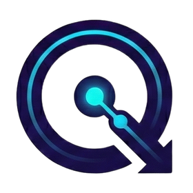

<div align="center">
  
  <h1>NexQuery AI</h1>
  <p><strong>智能数据协作平台 (Intelligent Data Collaboration Platform)</strong></p>
  <p>面向运营与非技术人员，通过 AI 驱动的自然语言交互，实现安全、自主的数据消费与分析。</p>
</div>

<div align="center">


</div>

## 📖 简介 (Introduction)

**NexQuery AI** 是一个现代化的 Text-to-SQL 数据协作平台。它致力于解决“业务提数难、研发排期长”的痛点，通过 Agentic workflow 让运营人员能够用自然语言直接查询数据库，同时保障企业级的数据安全与权限管控。

### 核心价值

1.  **自助提数 (Self-Service)**: 运营人员无需懂 SQL，直接提问即可获取数据报表。
2.  **安全可控 (Enterprise Safe)**: 细粒度的 RBAC 权限、PII 敏感数据自动脱敏、SQL 注入防御与审计日志。
3.  **闭环进化 (Self-Evolving)**: 支持用户反馈 (Feedback) 与知识库 (Knowledge Base) 联动，AI 越用越聪明。
4.  **团队协作 (Team Collaboration)**: 支持查询任务的私有化与公开分享，打破数据孤岛。

---

## 🚀 核心功能 (Features)

### 🤖 AI 智能引擎 (Agentic Engine)

- **Multi-Agent Workflow (LangGraph)**:
  - **Supervisor**: 智能调度中心，根据问题深度自动编排工作流。
  - **Discovery Agent**: 自动探索 Schema、Index Mapping 及多表关联关系。
  - **Generator Agent**: 支持 Text-to-SQL 与 Text-to-Lucene，具备错误自修复能力。
  - **Security Agent**: 实时审计生成的脚本，拦截危险操作并对 PII 数据进行脱敏。
- **Dual-Mode Chat**:
  - **SQL Agent**: 深度结合数据库 Schema，支持 Text-to-SQL、歧义主动询问 (Disambiguation) 与思维链展示。
  - **Lucene Agent**: 专为 Elasticsearch 设计，支持 Index 发现、Mapping 解析与查询语句生成。
- **Mind Chain**: 透明展示 AI 的推理过程 (Reasoning)、工具调用 (ListTables, ValidateSql) 与自我纠错逻辑。
- **Knowledge RAG**: 将用户认可的优质 SQL 沉淀为知识库，增强 AI 在特定业务场景下的准确率。
- **Hybrid AI Engine**: 支持同时接入 OpenAI 兼容模型 (如 GPT-4, DeepSeek) 与 智谱 AI (GLM-4) 等国产模型，灵活配置 Embedding 模型以优化 RAG 检索效果。

### 🔌 多源数据接入

- **Supported Sources**: PostgreSQL, MySQL, Elasticsearch, HTTP API (cURL 适配)。
- **Auto-Discovery**: 自动扫描数据库元数据，利用 AI 识别手机号、邮箱等 PII 敏感字段并配置脱敏规则。
- **Schema Sync**: 定时或触发式同步最新的表结构至向量数据库。

### 🛡 安全与治理

- **End-to-End Encryption**: 基于 `CryptoService` 实现敏感 API 负载的全链路加密，确保 API 密钥与敏感数据不可通过网络嗅探获取。
- **Precision RBAC**: 基于角色的权限控制，严格实施最小权限呈现原则。Dashboard 支持系统级全量视图与个人专属版面的动态区隔。
- **Enterprise-Grade Protection**:
  - **OOM Defense**: 查询引擎自带行数熔断 (LIMIT 1000兜底)，阻止巨量数据拉垮服务器内存。
  - **RCE Prevention**: 核心沙箱阻隔 Shell 元字符注入，彻底杜绝命令执行逃逸。
  - **IDOR Proof**: 数据源探测和任务协同均具备行列级越权防御，普通员工无法窥探越权数据。
- **安全过滤拦截**: 拦截 `DROP`, `TRUNCATE` 等高危动作，并对生成的查询进行强制验证。
- **2FA**: 集成 Google Authenticator 双重认证。

### ⚙️ 自动化与触达

- **Parameterized Scheduler**: 支持 Crontab 定时执行 SQL 报表任务，支持配置**动态占位符参数**，实现千人千面的自动化报表。
- **AI Feedback Loop**: 用户可以直接对 AI 生成的 SQL/Lucene 进行评价与校正，系统支持从反馈中**自动学习**，持续提升准确率。
- **Multi-Channel Push**:
  - **Email**: 自动发送带有数据的 CSV 附件。
  - **IM Webhook**: 支持企业微信、钉钉、飞书群机器人实时推送数据摘要。
- **Mini Program**: 配套微信小程序，随时随地查看报表与历史记录。

---

## 🛠 技术栈 (Tech Stack)

本项目采用 **Monorepo** 架构，统一管理前后端与共享库。

| Component               | Status         | Description                                                                          |
| :---------------------- | :------------- | :----------------------------------------------------------------------------------- |
| **Multi-Agent Graph**   | ✅ Implemented | LangGraph-based workflow with Supervisor and specialized agents.                     |
| **Payload Encryption**  | ✅ Implemented | AES-256 encryption for sensitive data exchange using shared key.                     |
| **AI SQL Generation**   | ✅ Implemented | Robust backend agent using LangChain, schema retrieval, and self-correction.         |
| **Reasoning Display**   | ✅ Implemented | Users can see "thoughts" and "tool calls" (e.g., schema lookup, validation).         |
| **Data Report Display** | ✅ Implemented | Results are rendered as an interactive table directly inside the chat.               |
| **Code Editor**         | ✅ Implemented | Integrated **CodeMirror 6** with SQL/Lucene syntax highlighting and auto-completion. |
| **Mobile**              | Uni-app + Vite | 跨平台小程序开发                                                                     |

---

## 📚 文档导航 (Documentation)

- [👨‍💻 开发者指南 (Developer Guide)](docs/development.md): 包含环境搭建、架构设计、Docker 部署与模块说明。
- [📖 用户手册 (User Manual)](docs/user_manual.md): 详细的产品功能使用说明书，适合最终用户与管理员。

---

## ⚡️ 快速开始 (Quick Start)

### 前置要求

- [Docker](https://www.docker.com/) & Docker Compose
- [Node.js](https://nodejs.org/) v20+ & pnpm
- [FFmpeg](https://ffmpeg.org/) (用于语音输入转码)

### 开发环境启动

1.  **克隆仓库**:

    ```bash
    git clone https://github.com/OSpoon/nexquery-ai.git
    cd nexquery-ai
    ```

2.  **环境配置**:

    ```bash
    cp .env.example .env
    # 编辑 .env 填入必要的 API Key (OpenAI/GLM) 和数据库密码
    ```

3.  **初始化与启动**:

    ```bash
    # 1. 安装依赖
    pnpm install

    # 2. 启动基础设施 (PostgreSQL, Redis)
    docker compose up -d

    # 3. 初始化数据库 (首次运行必需)
    pnpm backend:migrate
    pnpm backend:seed  # 填充默认管理员与菜单数据

    # 4. 启动应用
    pnpm dev
    ```

4.  **访问**:
    - Web: `http://localhost:3000`
    - Default Admin: `admin@nexquery.ai` / `password`

---

<div align="center">
    Copyright © 2025-2026 NexQuery AI Team. Apache 2.0 Licensed.
</div>
